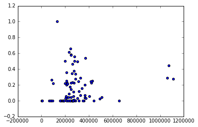

```python
import sys
import pickle
import matplotlib.pyplot as plt
import numpy as np
sys.path.append("../tools/")

from feature_format import featureFormat, targetFeatureSplit
from tester import dump_classifier_and_data
```

## Task 1: Select what features you'll use.


```python
### features_list is a list of strings, each of which is a feature name.
### The first feature must be "poi".
financial_features = ['salary', 'deferral_payments', 'total_payments', 'loan_advances', 'bonus', 
                      'restricted_stock_deferred', 'deferred_income', 'total_stock_value', 
                      'expenses', 'exercised_stock_options', 'other', 'long_term_incentive', 
                      'restricted_stock', 'director_fees']

email_features = ['to_messages', 'from_poi_to_this_person', 'from_messages', 
                  'from_this_person_to_poi', 'shared_receipt_with_poi']

features_list = ["poi"] + financial_features + email_features


### Load the dictionary containing the dataset
with open("final_project_dataset.pkl", "r") as data_file:
    data_dict = pickle.load(data_file)
```

Let's see what the data looks like to get a feel for it.


```python
name = data_dict.keys()[5]
print name
for item in data_dict[name]:
    if item in features_list:
        print item, ": ", data_dict[name][item]
```

    MORDAUNT KRISTINA M
    salary :  267093
    to_messages :  NaN
    deferral_payments :  NaN
    total_payments :  628522
    exercised_stock_options :  NaN
    bonus :  325000
    restricted_stock :  208510
    shared_receipt_with_poi :  NaN
    restricted_stock_deferred :  NaN
    total_stock_value :  208510
    expenses :  35018
    loan_advances :  NaN
    from_messages :  NaN
    other :  1411
    from_this_person_to_poi :  NaN
    poi :  False
    director_fees :  NaN
    deferred_income :  NaN
    long_term_incentive :  NaN
    from_poi_to_this_person :  NaN


## Task 2: Remove outliers


```python
plt.scatter([v["salary"] for k,v in data_dict.items()], [v["total_payments"] for k,v in data_dict.items()])
plt.show()
```


Inspection of the data set (as done in the lesson on outliers) as well as the accompanying PDF with the data shows that this outlier goes by the name of "TOTAL" and that there is also another interesting entry called THE TRAVEL AGENCY IN THE PARK. Both do not appear to be employees, so we'll remove those.


```python
data_dict.pop("TOTAL", 0) #discovered in the Outlier Lesson
data_dict.pop("THE TRAVEL AGENCY IN THE PARK", 0) #from the accompanying PDF

plt.scatter([v["salary"] for k,v in data_dict.items()], [v["bonus"] for k,v in data_dict.items()])
plt.show()
```


Next up, let's see how many NaN's we have per feature. We could see in our previous exploration of what the data looks like, that there are already a lot of NaN's showing up.


```python
print "Number of NaN's per feature"
for f in features_list:
    print f, ": ", sum([1 for k,v in data_dict.items() if v[f] == "NaN"])
```

    Number of NaN's per feature
    poi :  0
    salary :  50
    deferral_payments :  106
    total_payments :  21
    loan_advances :  141
    bonus :  63
    restricted_stock_deferred :  127
    deferred_income :  96
    total_stock_value :  19
    expenses :  50
    exercised_stock_options :  43
    other :  53
    long_term_incentive :  79
    restricted_stock :  35
    director_fees :  128
    to_messages :  58
    from_poi_to_this_person :  58
    from_messages :  58
    from_this_person_to_poi :  58
    shared_receipt_with_poi :  58


Seeing this I wondered what an estimator would even go on with so many NaN's. But obviously when it comes to payments, people can receive money in various ways, and this does not necessary mean that there is no information at all about what an employee has received financially. Let's first see if there are people about whom we have no financial data at all.


```python
finance_nans = [k for k,v in data_dict.items() if all([v[f] == "NaN" for f in financial_features])]
print "No financial information at all: ", finance_nans
```

    No financial information at all:  ['LOCKHART EUGENE E']


This is promising, because it means that for almost every entry in our data set there is some financial information. Considering that there is such a difference in how people can be compensated, it may be interesting to add an extra feature with total_value where we combine total_payments and total_stock_value.

Lastly, the POI's are obviously underrepresented in the data set. That means that the probability of someone being a POI is already very low, so it is easy for a classifier to underestimate the chances of someone being a POI and still have a high accuracy. So let's first establish a base rate and look at the ratio of POI's in our data set.


```python
is_poi = sum([1 for k,v in data_dict.items() if v["poi"]])
is_not_poi = sum([1 for k,v in data_dict.items() if not v["poi"]])
print "Number of POI's: ", is_poi
print "Number of non POI's: ", is_not_poi
print "Chance of randomly selecting non POI: ", is_not_poi / float(is_poi + is_not_poi)
```

    Number of POI's:  18
    Number of non POI's:  126
    Chance of randomly selecting non POI:  0.875


This would mean that just going for always saying someone is not a POI will give you a .875 accuracy score. 

## Task 3: Feature Selection and Creation

Let's continue with feature selection and creation. One of the things I think is interesting to add as a feature is the ratio of messages received from and sent to POI's. Receiving a lot of emails from a POI does not necessarily mean a strong relation if that person receives a lot of emails from everyone, so a rate may be more telling of what is going on.

#### *Feature: from/to POI*


```python
for k,v in data_dict.items():
    if v["from_poi_to_this_person"] != "NaN" and v["from_this_person_to_poi"] != "NaN":
        v["from_POI_rate"] = v["from_poi_to_this_person"] / float(v["to_messages"])
        v["to_POI_rate"] = v["from_this_person_to_poi"] / float(v["from_messages"])
    else:
        v["from_POI_rate"] = 0
        v["to_POI_rate"] = 0
        
features_list.append("from_POI_rate")
features_list.append("to_POI_rate")
```


```python
plt.scatter([v["salary"] for k,v in data_dict.items()], [v["to_POI_rate"] for k,v in data_dict.items()])
plt.show()
```





It looks like there is one person with a rate of 1. Let's check who that is to make sure nothing went wrong in creating our feature.


```python
print [[k, v["to_POI_rate"], v] 
       for k,v in data_dict.items() if (v["to_POI_rate"] > 0.95)]
```

    [['HUMPHREY GENE E', 1.0, {'to_messages': 128, 'deferral_payments': 2964506, 'expenses': 4994, 'poi': False, 'deferred_income': 'NaN', 'email_address': 'gene.humphrey@enron.com', 'long_term_incentive': 'NaN', 'restricted_stock_deferred': 'NaN', 'shared_receipt_with_poi': 119, 'loan_advances': 'NaN', 'from_messages': 17, 'other': 'NaN', 'director_fees': 'NaN', 'to_POI_rate': 1.0, 'bonus': 'NaN', 'total_stock_value': 2282768, 'from_poi_to_this_person': 10, 'from_this_person_to_poi': 17, 'restricted_stock': 'NaN', 'from_POI_rate': 0.078125, 'salary': 130724, 'total_payments': 3100224, 'exercised_stock_options': 2282768}]]


Looks fine. So, let's continue with creating a total_value feature that will be a sum of all the financial features.

#### *Feature: Total Value*


```python
for k,v in data_dict.items():
    if not all([v[f] == "NaN" for f in financial_features]):
        v["total_value"] = sum([v[f] for f in financial_features if (v[f] != "NaN")])
    else:
        v["total_value"] = "NaN"
        
features_list.append("total_value")
```


```python
for k,v in data_dict.items()[0:10]:
    print k,":\n", v["total_value"],",", v["total_payments"], ",", v["total_stock_value"]
```

    METTS MARK :
    3293778 , 1061827 , 585062
    BAXTER JOHN C :
    32515202 , 5634343 , 10623258
    ELLIOTT STEVEN :
    13780920 , 211725 , 6678735
    CORDES WILLIAM R :
    2076370 , NaN , 1038185
    HANNON KEVIN P :
    13359494 , 288682 , 6391065
    MORDAUNT KRISTINA M :
    1674064 , 628522 , 208510
    MEYER ROCKFORD G :
    5608200 , 1848227 , 955873
    MCMAHON JEFFREY :
    11525252 , 4099771 , 1662855
    HORTON STANLEY C :
    20777016 , 3131860 , 7256648
    PIPER GREGORY F :
    5235838 , 1737629 , 880290


```python

```

#### *Extract features and labels from dataset for local testing*


```python
from sklearn.feature_selection import SelectKBest, f_classif, chi2
from sklearn import cross_validation
from sklearn.preprocessing import MinMaxScaler, StandardScaler

### Store to my_dataset for easy export for the grader.
my_dataset = data_dict

data = featureFormat(my_dataset, features_list, sort_keys = True)
labels, features = targetFeatureSplit(data)

features_train, features_test, labels_train, labels_test = cross_validation.train_test_split(
    features, labels, test_size=0.3, random_state=42)
```


```python
selector = SelectKBest(f_classif, k=15)
selector.fit_transform(features_train, labels_train)

# Get KBest scores (rounded off)
feature_scores = ['%.3f' % x for x in selector.scores_ ]
# And p values:
feature_scores_pvalues = ['%.3f' % x for x in  selector.pvalues_ ]
# Get the feature names through the indices stored in .get_support_
features_selected=[(features_list[i+1], feature_scores[i], feature_scores_pvalues[i]) for i in selector.get_support(indices=True)]

# Sort the tuple by score, in reverse order
features_selected = sorted(features_selected, key=lambda feature: float(feature[1]) , reverse=True)

print 'Selected Features, Scores, P-Values'
for x in features_selected:
    print x
    
selected_feature_list = ["poi"] + [features_list[i+1] for i in selector.get_support(indices=True)]
```

    Selected Features, Scores, P-Values
    ('bonus', '30.729', '0.000')
    ('salary', '15.859', '0.000')
    ('to_POI_rate', '15.838', '0.000')
    ('total_value', '10.803', '0.001')
    ('shared_receipt_with_poi', '10.723', '0.001')
    ('total_stock_value', '10.634', '0.002')
    ('exercised_stock_options', '9.680', '0.002')
    ('total_payments', '8.959', '0.003')
    ('deferred_income', '8.792', '0.004')
    ('restricted_stock', '8.058', '0.006')
    ('long_term_incentive', '7.555', '0.007')
    ('loan_advances', '7.038', '0.009')
    ('from_poi_to_this_person', '4.959', '0.028')
    ('expenses', '4.181', '0.044')
    ('other', '3.204', '0.077')


## Task 4: Classification


```python
from sklearn.naive_bayes import GaussianNB
from sklearn.neighbors import KNeighborsClassifier
from sklearn.svm import SVC
from sklearn.tree import DecisionTreeClassifier
from sklearn.metrics import classification_report
from sklearn.metrics import confusion_matrix
from sklearn.metrics import accuracy_score

def score_clf(clf_selected, features_selected):
    data = featureFormat(my_dataset, features_selected, sort_keys = True)
    labels, features = targetFeatureSplit(data)
    
    features_scaled = StandardScaler().fit_transform(features)

    features_train, features_test, labels_train, labels_test = cross_validation.train_test_split(
    features_scaled, labels, test_size=0.3, random_state=42)
    
    clf = clf_selected
    clf.fit(features_train, labels_train)
    pred = clf.predict(features_test)

    print "Using classifier: \n\t", str(clf_selected)
    print
    print "With features: \n\t", features_selected
    print
    print "Accuracy is %.2f" % accuracy_score(pred, labels_test)
    print
    print classification_report(labels_test, pred)
    print
    print confusion_matrix(labels_test, pred)
```

#### Naive Bayes Classifier


```python
score_clf(GaussianNB(), selected_feature_list)
```

    Using classifier: 
    	GaussianNB()
    
    With features: 
    	['poi', 'salary', 'total_payments', 'loan_advances', 'bonus', 'deferred_income', 'total_stock_value', 'expenses', 'exercised_stock_options', 'other', 'long_term_incentive', 'restricted_stock', 'from_poi_to_this_person', 'shared_receipt_with_poi', 'to_POI_rate', 'total_value']
    
    Accuracy is 0.86
    
                 precision    recall  f1-score   support
    
            0.0       0.92      0.92      0.92        38
            1.0       0.40      0.40      0.40         5
    
    avg / total       0.86      0.86      0.86        43
    
    
    [[35  3]
     [ 3  2]]


#### K Nearest Neighbors Classifier


```python
score_clf(KNeighborsClassifier(n_neighbors=3), selected_feature_list)
```

    Using classifier: 
    	KNeighborsClassifier(algorithm='auto', leaf_size=30, metric='minkowski',
               metric_params=None, n_jobs=1, n_neighbors=3, p=2,
               weights='uniform')
    
    With features: 
    	['poi', 'salary', 'total_payments', 'loan_advances', 'bonus', 'deferred_income', 'total_stock_value', 'expenses', 'exercised_stock_options', 'other', 'long_term_incentive', 'restricted_stock', 'from_poi_to_this_person', 'shared_receipt_with_poi', 'to_POI_rate', 'total_value']
    
    Accuracy is 0.84
    
                 precision    recall  f1-score   support
    
            0.0       0.88      0.95      0.91        38
            1.0       0.00      0.00      0.00         5
    
    avg / total       0.78      0.84      0.81        43
    
    
    [[36  2]
     [ 5  0]]


#### SVM Classifier


```python
score_clf(SVC(kernel='rbf'), selected_feature_list)
```

    Using classifier: 
    	SVC(C=1.0, cache_size=200, class_weight=None, coef0=0.0,
      decision_function_shape=None, degree=3, gamma='auto', kernel='rbf',
      max_iter=-1, probability=False, random_state=None, shrinking=True,
      tol=0.001, verbose=False)
    
    With features: 
    	['poi', 'salary', 'total_payments', 'bonus', 'restricted_stock_deferred', 'total_stock_value', 'expenses', 'exercised_stock_options', 'long_term_incentive', 'restricted_stock', 'to_messages', 'from_poi_to_this_person', 'from_this_person_to_poi', 'shared_receipt_with_poi', 'from_POI_rate', 'total_value']
    
    Accuracy is 0.88
    
                 precision    recall  f1-score   support
    
            0.0       0.88      1.00      0.94        38
            1.0       0.00      0.00      0.00         5
    
    avg / total       0.78      0.88      0.83        43
    
    
    [[38  0]
     [ 5  0]]


```python
score_clf(DecisionTreeClassifier(), selected_feature_list)
```

    Using classifier: 
    	DecisionTreeClassifier(class_weight=None, criterion='gini', max_depth=None,
                max_features=None, max_leaf_nodes=None, min_samples_leaf=1,
                min_samples_split=2, min_weight_fraction_leaf=0.0,
                presort=False, random_state=None, splitter='best')
    
    With features: 
    	['poi', 'salary', 'total_payments', 'loan_advances', 'bonus', 'deferred_income', 'total_stock_value', 'expenses', 'exercised_stock_options', 'other', 'long_term_incentive', 'restricted_stock', 'from_poi_to_this_person', 'shared_receipt_with_poi', 'to_POI_rate', 'total_value']
    
    Accuracy is 0.86
    
                 precision    recall  f1-score   support
    
            0.0       0.92      0.92      0.92        38
            1.0       0.40      0.40      0.40         5
    
    avg / total       0.86      0.86      0.86        43
    
    
    [[35  3]
     [ 3  2]]


The first problem that pops up here is that because of our small sample size the score greatly varies everytime we run the algorithm. Also we want to make sure that our precision and recall are good enough, not just randomly, but by tuning our model. Precision and recall are good metrics in our case, because there is such a relatively small number of POI's that we want to know if the model identifies anything at all and if it does, how often is it correct? So let's move on to tuning our model.

## Task 5: Tuning the Model


```python
from sklearn.grid_search import GridSearchCV
from sklearn.cross_validation import StratifiedShuffleSplit
from sklearn.metrics import classification_report, precision_score
from sklearn.pipeline import Pipeline
from sklearn.preprocessing import MinMaxScaler, RobustScaler
from time import time

data = featureFormat(my_dataset, features_list, sort_keys = True)
labels, features = targetFeatureSplit(data)

clfs = [GaussianNB(), KNeighborsClassifier(), SVC(), DecisionTreeClassifier()]

params = [{ #Naive Bayes
        'ft_select__k' : [5, 10, 15]
    },
          { #K Nearest Neighbors
        'ft_select__k' : [5, 10, 15],
        'clf__n_neighbors' : [2, 3, 5, 10, 30],
        'clf__leaf_size' : [2, 8, 10, 14, 30],
        'clf__weights' : ['uniform', 'distance'],
        'clf__algorithm' : ['ball_tree', 'kd_tree']
    },
        { #Support Vector Machine
        'ft_select__k' : [5, 10, 15],
        'clf__kernel' : ['rbf'],
        'clf__C': [1, 1.5, 2, 5, 10],
        'clf__gamma' :[0.00001, 0.001, 0.1, 1, 10.0, 100.0]
    },
         {#DecisionTree
        'ft_select__k' : [5, 10, 15],
        'clf__min_samples_split' : [2, 3, 5, 10, 12, 15, 20],
        'clf__min_samples_leaf' : [2, 3, 5, 10, 12, 15, 20],
        'clf__max_depth' : [5, 10, 15],
        'clf__splitter' : ['best']
    }]

for x in range(0,4):
    t0 = time()
    print "Using: ", clfs[x], "\nWith parameters: ", params[x]

    steps = [
        ('scaler', StandardScaler()),
        ('ft_select', SelectKBest()),
        ('clf', clfs[x])]    
    
    cv = StratifiedShuffleSplit(labels, n_iter=100, test_size=0.1, random_state=24)
    grid = GridSearchCV(Pipeline(steps), param_grid=params[x], cv=cv, scoring="f1")
    grid.fit(features, labels)

    print "Best parameters: ", grid.best_params_, 
    print "\nBest score: ", grid.best_score_
    print "\ntraining time: ", round(time()-t0, 3)
    print "\n--------------------------------------\n"
    
    
```

    Using:  GaussianNB() 
    With parameters:  {'ft_select__k': [5, 10, 15]}
    Best parameters:  {'ft_select__k': 15} 
    Best score:  0.302132478632
    
    training time:  1.679
    
    --------------------------------------
    
    Using:  KNeighborsClassifier(algorithm='auto', leaf_size=30, metric='minkowski',
               metric_params=None, n_jobs=1, n_neighbors=5, p=2,
               weights='uniform') 
    With parameters:  {'ft_select__k': [5, 10, 15], 'clf__leaf_size': [2, 8, 10, 14, 30], 'clf__algorithm': ['ball_tree', 'kd_tree'], 'clf__weights': ['uniform', 'distance'], 'clf__n_neighbors': [2, 3, 5, 10, 30]}
    Best parameters:  {'clf__weights': 'distance', 'clf__n_neighbors': 2, 'clf__algorithm': 'ball_tree', 'ft_select__k': 5, 'clf__leaf_size': 2} 
    Best score:  0.251833333333
    
    training time:  262.131
    
    --------------------------------------
    
    Using:  SVC(C=1.0, cache_size=200, class_weight=None, coef0=0.0,
      decision_function_shape=None, degree=3, gamma='auto', kernel='rbf',
      max_iter=-1, probability=False, random_state=None, shrinking=True,
      tol=0.001, verbose=False) 
    With parameters:  {'clf__gamma': [1e-05, 0.001, 0.1, 1, 10.0, 100.0], 'ft_select__k': [5, 10, 15], 'clf__C': [1, 1.5, 2, 5, 10], 'clf__kernel': ['rbf']}
    Best parameters:  {'clf__gamma': 10.0, 'ft_select__k': 5, 'clf__C': 2, 'clf__kernel': 'rbf'} 
    Best score:  0.102333333333
    
    training time:  91.592
    
    --------------------------------------
    
    Using:  DecisionTreeClassifier(class_weight=None, criterion='gini', max_depth=None,
                max_features=None, max_leaf_nodes=None, min_samples_leaf=1,
                min_samples_split=2, min_weight_fraction_leaf=0.0,
                presort=False, random_state=None, splitter='best') 
    With parameters:  {'clf__splitter': ['best'], 'ft_select__k': [5, 10, 15], 'clf__max_depth': [5, 10, 15], 'clf__min_samples_leaf': [2, 3, 5, 10, 12, 15, 20], 'clf__min_samples_split': [2, 3, 5, 10, 12, 15, 20]}
    Best parameters:  {'clf__splitter': 'best', 'ft_select__k': 15, 'clf__max_depth': 15, 'clf__min_samples_leaf': 2, 'clf__min_samples_split': 15} 
    Best score:  0.292595238095
    
    training time:  402.261
    
    --------------------------------------
    


```python

```


```python

```
